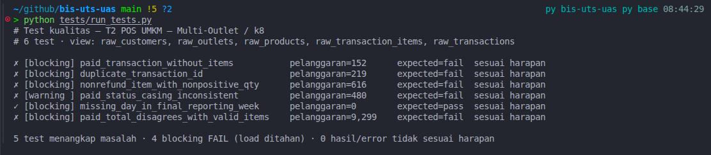
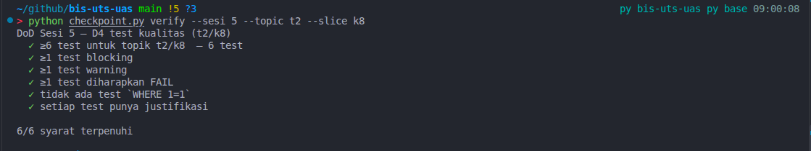

# Tugas D4 — Uji Kualitas Data T2/k8

Nama: Titanio Yudista

NIM: 24120500031

Topik: POS UMKM Multi-Outlet · Slice: k8 · Periode laporan: 2025.

Repositori: [https://github.com/titan2903/bis-uts-uas](https://github.com/titan2903/bis-uts-uas)

## Enam dimensi

| Dimensi | Test | Hasil | Severity |
|---|---|---:|---|
| Completeness | PAID tanpa item | 152 FAIL | blocking |
| Uniqueness | ID transaksi duplikat | 219 FAIL | blocking |
| Validity | Qty tidak sah di luar refund | 616 FAIL | blocking |
| Consistency | Kapitalisasi status PAID | 480 FAIL | warning |
| Timeliness | Freshness outlet saat tutup laporan | 0 PASS | blocking |
| Accuracy | Total PAID ≠ jumlah item valid | 9.299 FAIL | blocking |

Grain: satu transaksi di header (transaction_id), satu item di detail (item_id). Rekonsiliasi accuracy hanya memakai transaksi PAID dengan header unik, item unik, dan qty positif agar hasil tidak terlipat karena duplikasi.

Timeliness memakai freshness per outlet: tanggal transaksi terakhir harus mencapai 31 Desember 2025. Ini asumsi kebutuhan laporan tahunan pada tanggal tutup, memakai tanggal transaksi tercatat sebagai proksi; keterlambatan ingest tidak dapat diukur karena timestamp ingest tidak tersedia.

## Bukti eksekusi

Perintah aktual: .venv/bin/python tests/run_tests.py

```text
# Test kualitas — T2 POS UMKM — Multi-Outlet / k8
# 6 test · view: raw_customers, raw_outlets, raw_products, raw_transaction_items, raw_transactions

✗ [blocking] paid_transaction_without_items           pelanggaran=152      expected=fail  sesuai harapan
✗ [blocking] duplicate_transaction_id                 pelanggaran=219      expected=fail  sesuai harapan
✗ [blocking] nonrefund_item_with_nonpositive_qty      pelanggaran=616      expected=fail  sesuai harapan
✗ [warning ] paid_status_casing_inconsistent          pelanggaran=480      expected=fail  sesuai harapan
✓ [blocking] outlet_data_stale_at_report_cutoff       pelanggaran=0        expected=pass  sesuai harapan
✗ [blocking] paid_total_disagrees_with_valid_items    pelanggaran=9,299    expected=fail  sesuai harapan

5 test menangkap masalah · 4 blocking FAIL (load ditahan) · 0 hasil/error tidak sesuai harapan
```

Exit code: 1 karena empat test blocking FAIL.

Tafsir: FAIL pada duplicate_transaction_id menunjukkan 219 ID transaksi muncul lebih dari sekali di raw_transactions; satu transaksi dapat terhitung ganda dan menggelembungkan omzet.

## Keputusan blocking vs warning

Keputusan tersulit ialah memberi warning pada 480 status paid/Paid. Keduanya masih berarti PAID, sehingga normalisasi UPPER(TRIM(status)) dapat mempertahankan seluruh transaksi tanpa menebak nilai; agregasi harus memakai status baku. Saya tidak memblokir sumber karena perbaikannya deterministik, tetapi warning perlu dipantau agar dashboard peka kapital tidak mengurangi omzet. Artefak sesi05-advora-clid.md menunjukkan pipeline hijau, data merah: job sukses setiap malam sementara avclid di sisi server 0%. Karena itu suksesnya job tidak membuktikan isi data sehat.

Jumlah kata paragraf: 72.

Ulangi dengan: .venv/bin/python tests/run_tests.py --topic t2 --slice k8

## Lampiran screenshot bukti

### Output test kualitas data



### Output checkpoint D4




## Alasan dan batas cakupan test

- **completeness — blocking**: Transaksi PAID tanpa item membuat keputusan penjualan per produk dan kategori salah, jadi pemuatan diblokir.
- **uniqueness — blocking**: ID transaksi kembar mengaburkan satu transaksi dan dapat menggandakan omzet, jadi pemuatan diblokir.
- **validity — blocking**: Qty tidak positif di luar refund mengubah unit dan omzet secara salah, jadi pemuatan diblokir.
- **consistency — warning**: Kapitalisasi paid dan Paid dapat dinormalkan tanpa kehilangan transaksi; beri peringatan agar agregasi memakai status baku.
- **timeliness — blocking**: Data outlet yang belum mencapai tanggal tutup laporan dapat membuat perbandingan omzet tahunan salah, jadi pemuatan diblokir.
- **accuracy — blocking**: Total PAID yang berbeda dari jumlah item membuat angka omzet salah, jadi pemuatan diblokir.

Accuracy mengasumsikan diskon nominal per baris item: SUM(qty × harga_satuan − diskon). Header dan item duplikat serta qty tidak positif dikeluarkan dari rekonsiliasi agar grain tidak terlipat. Seed tidak memiliki nilai numerik NULL; pemeriksaan ini bukan audit seluruh cacat yang mungkin terjadi.

Qty tidak positif dikecualikan hanya bila seluruh header untuk ID terkait berstatus REFUND. Status campuran tidak dianggap refund yang sah.

Warning kapitalisasi berlaku dengan prasyarat status dinormalkan sebelum agregasi. Runner menghasilkan exit code untuk keputusan gate; runner tidak menjalankan atau mengubah loader.

Screenshot berasal dari eksekusi awal (timeliness berupa cakupan hari); log di atas berasal dari test terbaru yang memakai freshness per outlet. Hasil hitung enam test tetap sama. Gambar asli dipertahankan.
